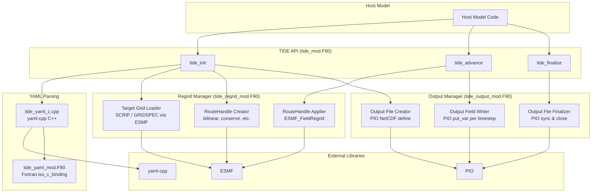
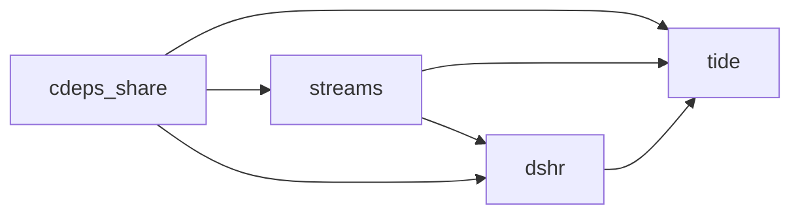

# Design Document: TIDE PIO Regrid Output

## Overview

This design adds output, regridding, and repository restructuring capabilities to the TIDE library. The feature enables TIDE to regrid time-interpolated data from the host model's source mesh onto a user-specified target grid (via ESMF) and write the result to CF-compliant NetCDF files (via PIO). Configuration is driven entirely by YAML, extending the existing yaml-cpp/Fortran interface. The repository is also restructured with a top-level CMakeLists.txt and a project-specific README.

The design follows the existing TIDE architecture: C++ yaml-cpp parsing exposed to Fortran via `iso_c_binding`, ESMF for mesh/field/clock abstractions, and PIO for parallel I/O. Two new modules are introduced — `tide_regrid_mod.F90` (Regrid_Manager) and `tide_output_mod.F90` (Output_Manager) — which are orchestrated by the existing `tide_mod.F90` API. Output is opt-in per stream: if a YAML stream block contains an `output` sub-block, TIDE initializes regridding and output for that stream; otherwise, the stream behaves exactly as before.

## Architecture



### Build Dependency Order



The top-level CMakeLists.txt discovers ESMF, PIO, and yaml-cpp, then adds subdirectories in dependency order: `share/` → `streams/` → `dshr/` → `tide/`.

## Components and Interfaces

### 1. Top-Level Build System (CMakeLists.txt)

A new top-level `CMakeLists.txt` at the repository root:

- Sets `cmake_minimum_required(VERSION 3.18)` and `project(TIDE Fortran C CXX)`.
- Includes `cmake/FindESMF.cmake` and `cmake/FindPIO.cmake`.
- Finds yaml-cpp via `find_package(yaml-cpp REQUIRED)`.
- Adds subdirectories: `share`, `streams`, `dshr`, `tide`.
- Defines a `BUILD_TESTING` option; when ON, adds `tide/tests` as a subdirectory.
- Provides `install()` targets for libraries and Fortran `.mod` files.

A new `tide/CMakeLists.txt` replaces any ad-hoc build for the tide sub-library:

- Compiles `tide_yaml_c.cpp` (C++) and all `.F90` sources in `tide/src/`.
- Links against `dshr`, `streams`, `cdeps_share`, ESMF, PIO, and yaml-cpp.
- Installs the `tide` library target.

### 2. YAML Output Configuration Parsing

The existing C++ parser (`tide_yaml_c.cpp`) and Fortran interface (`tide_yaml_mod.F90`) are extended.

**C++ side** — new struct and parsing logic:

```c
typedef struct {
    char* target_grid_file;   // Path to SCRIP/GRIDSPEC file
    char* output_file;        // Path to output NetCDF file
    int   output_frequency;   // Write interval in seconds
    char* regrid_method;      // "bilinear", "neareststod", "nearestdtos", "conserve"
    char** output_fields;     // List of field names to output
    int   num_output_fields;  // Length of output_fields array
    int   output_enabled;     // 1 if output block present, 0 otherwise
} tide_output_config_t;
```

This struct is added as a member of `tide_stream_config_t`. When the YAML parser encounters an `output` key inside a stream, it populates this struct. When absent, `output_enabled` is set to 0.

Validation in the C++ parser:
- If `output` is present but `target_grid_file` is missing/empty → return `nullptr` with error log.
- If `regrid_method` is not one of the four accepted values → return `nullptr` with error log.
- Default `regrid_method` to `"bilinear"` if absent.
- Default `output_frequency` to `3600` (1 hour) if absent.
- If `output_fields` is absent or empty, `num_output_fields` is set to 0 (meaning "write all fields").

A pretty-printer function `tide_output_config_to_yaml` is added to the C++ side, exposed via `extern "C"`, to serialize a `tide_output_config_t` back to a YAML string. This enables round-trip testing.

**Fortran side** — new `bind(c)` type in `tide_yaml_mod.F90`:

```fortran
type, bind(c) :: tide_output_config_t
  type(c_ptr) :: target_grid_file
  type(c_ptr) :: output_file
  integer(c_int) :: output_frequency
  type(c_ptr) :: regrid_method
  type(c_ptr) :: output_fields
  integer(c_int) :: num_output_fields
  integer(c_int) :: output_enabled
end type tide_output_config_t
```

Added as a member of `tide_stream_config_t`.

**YAML structure example:**

```yaml
streams:
  - name: sst_stream
    # ... existing stream fields ...
    output:
      target_grid_file: "/grids/target_1deg.nc"
      output_file: "/output/sst_regridded.nc"
      output_frequency: 3600
      regrid_method: "bilinear"
      output_fields:
        - "sst"
        - "ice_fraction"
```

### 3. Regrid Manager (`tide_regrid_mod.F90`)

New module providing target grid loading and ESMF regridding.

**Public types:**

```fortran
type :: tide_regrid_state_t
  type(ESMF_Grid)        :: target_grid       ! Target grid loaded from file
  type(ESMF_RouteHandle) :: route_handle      ! Precomputed regrid weights
  type(ESMF_Field)       :: src_field         ! Scratch source field on model mesh
  type(ESMF_Field)       :: dst_field         ! Scratch destination field on target grid
  logical                :: initialized = .false.
end type tide_regrid_state_t
```

**Public subroutines:**

| Subroutine | Purpose |
|---|---|
| `tide_regrid_init(state, source_mesh, target_grid_file, regrid_method, rc)` | Loads target grid, creates RouteHandle |
| `tide_regrid_apply(state, src_data, dst_data, rc)` | Applies RouteHandle to regrid one field |
| `tide_regrid_finalize(state, rc)` | Destroys RouteHandle, fields, and target grid |

**Target grid loading logic:**

1. Attempt `ESMF_GridCreate` with `ESMF_FILEFORMAT_SCRIP`. If that fails:
2. Attempt `ESMF_GridCreate` with `ESMF_FILEFORMAT_GRIDSPEC`. If that also fails:
3. Return error code and log the file path and failure reason.

On success, log grid dimensions and coordinate range at info level.

**RouteHandle creation:**

Maps the `regrid_method` string to ESMF constants:

| YAML value | ESMF constant |
|---|---|
| `"bilinear"` | `ESMF_REGRIDMETHOD_BILINEAR` |
| `"neareststod"` | `ESMF_REGRIDMETHOD_NEAREST_STOD` |
| `"nearestdtos"` | `ESMF_REGRIDMETHOD_NEAREST_DTOS` |
| `"conserve"` | `ESMF_REGRIDMETHOD_CONSERVE` |

The RouteHandle is created once during `tide_regrid_init` and reused for all subsequent `tide_regrid_apply` calls within the same stream.

### 4. Output Manager (`tide_output_mod.F90`)

New module providing PIO-based NetCDF output.

**Public types:**

```fortran
type :: tide_output_field_t
  character(len=256) :: field_name
  integer            :: pio_varid
end type tide_output_field_t

type :: tide_output_state_t
  type(file_desc_t)                          :: pio_file
  type(io_desc_t)                            :: io_desc
  type(tide_output_field_t), allocatable     :: fields(:)
  integer                                    :: num_fields
  integer                                    :: time_varid
  integer                                    :: time_record    ! Current time record index
  integer                                    :: output_frequency
  integer                                    :: elapsed_seconds ! Seconds since last write
  logical                                    :: initialized = .false.
end type tide_output_state_t
```

**Public subroutines:**

| Subroutine | Purpose |
|---|---|
| `tide_output_init(state, pio_subsystem, output_file, target_grid, field_names, num_fields, output_frequency, rc)` | Creates NetCDF file, defines dims/vars/attrs |
| `tide_output_write(state, field_data, model_time, rc)` | Writes one time record for all fields |
| `tide_output_should_write(state, dt_seconds)` → logical | Checks if output_frequency interval has elapsed |
| `tide_output_finalize(state, rc)` | Syncs and closes PIO file |

**NetCDF file structure created by `tide_output_init`:**

- Global attributes: `Conventions = "CF-1.8"`, `history`, `source = "TIDE"`.
- Dimensions: `lat(nlat)`, `lon(nlon)`, `time(unlimited)`.
- Coordinate variables: `lat(lat)` with `units="degrees_north"`, `standard_name="latitude"`, `axis="Y"`; `lon(lon)` with `units="degrees_east"`, `standard_name="longitude"`, `axis="X"`; `time(time)` with `units="seconds since ..."`, `calendar`, `axis="T"`.
- Data variables: one per output field, dimensioned `(lon, lat, time)`, with `_FillValue` and `coordinates` attributes.

### 5. TIDE API Integration (`tide_mod.F90`)

The `tide_type` derived type is extended:

```fortran
type tide_type
  type(shr_strdata_type), allocatable :: sdat(:)
  integer :: num_streams
  integer :: year_first, year_last
  ! --- New output/regrid state ---
  type(tide_regrid_state_t), allocatable :: regrid(:)   ! One per stream
  type(tide_output_state_t), allocatable :: output(:)   ! One per stream
  logical, allocatable                   :: output_enabled(:) ! Per-stream flag
end type tide_type
```

**Integration points:**

- `tide_init`: After parsing YAML and initializing streams, for each stream where `output_enabled == 1`:
  1. Validate `output_fields` against the stream's `field_maps` (Requirement 7).
  2. Call `tide_regrid_init` with the source mesh, target grid file, and regrid method.
  3. Call `tide_output_init` with the PIO subsystem, output file path, target grid, field names, and frequency.

- `tide_advance`: After `shr_strdata_advance`, for each output-enabled stream:
  1. Check `tide_output_should_write` against the timestep size.
  2. If true: for each output field, call `tide_regrid_apply` then `tide_output_write`.
  3. If false: skip (no performance overhead).

- `tide_finalize`: Before deallocating `sdat`, for each output-enabled stream:
  1. Call `tide_output_finalize`.
  2. Call `tide_regrid_finalize`.

### 6. Output Field Selection and Validation

During `tide_init`, when `output_fields` is specified (non-empty list):
- Each entry is checked against the stream's `field_maps` model variable names.
- If any entry has no match, `tide_init` returns `ESMF_FAILURE` and logs the unrecognized field name.
- Field ordering in the NetCDF file matches the order in `output_fields`.

When `output_fields` is empty or absent (`num_output_fields == 0`):
- All fields from the stream's `field_maps` are written, in their original order.

## Data Models

### C Structs (tide_yaml_c.cpp)

```
tide_config_t
├── num_streams: int
└── streams: tide_stream_config_t[]
    ├── name, mesh_file, lev_dimname, tax_mode, ...  (existing)
    ├── cf_detection_mode, cf_cache_enabled, cf_log_level  (existing)
    └── output: tide_output_config_t
        ├── target_grid_file: char*
        ├── output_file: char*
        ├── output_frequency: int
        ├── regrid_method: char*
        ├── output_fields: char*[]
        ├── num_output_fields: int
        └── output_enabled: int
```

### Fortran Types

```
tide_type (tide_mod.F90)
├── sdat(:): shr_strdata_type          (existing)
├── num_streams: integer               (existing)
├── year_first, year_last: integer     (existing)
├── regrid(:): tide_regrid_state_t     (NEW)
│   ├── target_grid: ESMF_Grid
│   ├── route_handle: ESMF_RouteHandle
│   ├── src_field, dst_field: ESMF_Field
│   └── initialized: logical
├── output(:): tide_output_state_t     (NEW)
│   ├── pio_file: file_desc_t
│   ├── io_desc: io_desc_t
│   ├── fields(:): tide_output_field_t
│   ├── time_varid, time_record: integer
│   ├── output_frequency, elapsed_seconds: integer
│   └── initialized: logical
└── output_enabled(:): logical         (NEW)
```

### YAML Configuration Schema

```yaml
streams:
  - name: <string>           # Required
    # ... existing stream fields ...
    output:                   # Optional block — absence means no output
      target_grid_file: <string>   # Required if output present
      output_file: <string>        # Required if output present
      output_frequency: <int>      # Seconds; default 3600
      regrid_method: <string>      # "bilinear"|"neareststod"|"nearestdtos"|"conserve"; default "bilinear"
      output_fields:               # Optional; empty means all fields
        - <string>
```

### NetCDF Output File Schema

```
dimensions:
  lon = <nlon from target grid>
  lat = <nlat from target grid>
  time = UNLIMITED

variables:
  double lat(lat)
    :units = "degrees_north"
    :standard_name = "latitude"
    :axis = "Y"
  double lon(lon)
    :units = "degrees_east"
    :standard_name = "longitude"
    :axis = "X"
  double time(time)
    :units = "seconds since <reference>"
    :calendar = "noleap"
    :axis = "T"
  double <field>(lon, lat, time)
    :_FillValue = 1.0e30
    :coordinates = "lon lat"

global attributes:
  :Conventions = "CF-1.8"
  :history = "Created by TIDE"
  :source = "TIDE"
```


## Correctness Properties

*A property is a characteristic or behavior that should hold true across all valid executions of a system — essentially, a formal statement about what the system should do. Properties serve as the bridge between human-readable specifications and machine-verifiable correctness guarantees.*

### Property 1: YAML Output Configuration Round-Trip

*For any* valid `tide_output_config_t` structure (with a non-empty `target_grid_file`, a valid `regrid_method` from {"bilinear", "neareststod", "nearestdtos", "conserve"}, a positive `output_frequency`, a non-empty `output_file`, and zero or more `output_fields`), pretty-printing the structure to a YAML string and then parsing that YAML string back into a `tide_output_config_t` SHALL produce a structure equivalent to the original.

**Validates: Requirements 2.1, 2.2, 2.7, 2.8**

### Property 2: Invalid Regrid Method Rejection

*For any* string that is not a member of the set {"bilinear", "neareststod", "nearestdtos", "conserve"}, when that string is used as the `regrid_method` value in a YAML output block, the parser SHALL return an error (null pointer / non-zero return code).

**Validates: Requirements 2.6**

### Property 3: Output Write Frequency Trigger

*For any* positive `output_frequency` value and *for any* sequence of positive timestep durations (`dt` values), the `tide_output_should_write` function SHALL return true exactly when the cumulative elapsed time since the last write equals or exceeds `output_frequency`, and after returning true the elapsed counter SHALL reset so that the next write occurs after another `output_frequency` seconds have accumulated.

**Validates: Requirements 5.6**

### Property 4: Field Selection and Ordering Preservation

*For any* non-empty ordered subset of field names drawn from a stream's `field_maps` model variable names, when that subset is provided as `output_fields`, the Output_Manager SHALL define NetCDF variables for exactly those fields and in exactly the order specified — no extra fields, no missing fields, and no reordering.

**Validates: Requirements 7.1, 7.4**

### Property 5: Invalid Output Field Rejection

*For any* field name string that does not appear in the stream's `field_maps` model variable names, when that string is included in `output_fields`, the TIDE initialization SHALL return an error code and the output file SHALL not be created.

**Validates: Requirements 7.3**

## Error Handling

All error handling follows the existing TIDE pattern: subroutines return an integer `rc` parameter, with `ESMF_SUCCESS` (0) for success and `ESMF_FAILURE` or specific `CF_ERR_*` constants for failure. Errors are logged to the TIDE log unit before returning.

| Error Condition | Module | Return Code | Behavior |
|---|---|---|---|
| YAML `output` block present but `target_grid_file` missing/empty | tide_yaml_c.cpp | `nullptr` return | Log error with filename, abort stream parsing |
| Unrecognized `regrid_method` value | tide_yaml_c.cpp | `nullptr` return | Log invalid value, abort stream parsing |
| Target grid file not found or unreadable | tide_regrid_mod | `ESMF_FAILURE` | Log file path, skip output for this stream |
| Target grid file format unrecognized (neither SCRIP nor GRIDSPEC) | tide_regrid_mod | `ESMF_FAILURE` | Log file path and attempted formats |
| ESMF RouteHandle creation fails (incompatible geometries) | tide_regrid_mod | `ESMF_FAILURE` | Log source/target info, skip output for this stream |
| PIO output file cannot be created | tide_output_mod | `ESMF_FAILURE` | Log file path and PIO error code |
| PIO write fails during `tide_output_write` | tide_output_mod | `ESMF_FAILURE` | Log field name and PIO error code |
| `output_fields` entry not found in stream's `field_maps` | tide_mod | `ESMF_FAILURE` | Log unrecognized field name, abort `tide_init` |

**Error propagation strategy:** Errors in output/regrid initialization are fatal for `tide_init` — the host model receives `ESMF_FAILURE` and can decide whether to abort or continue without output. Errors during `tide_advance` output writes are logged but do not prevent the stream's data interpolation from completing (the input path is unaffected).

## Testing Strategy

### Unit Tests (Example-Based)

Unit tests verify specific scenarios and edge cases using concrete inputs:

| Test | Validates |
|---|---|
| Parse YAML stream without `output` block → `output_enabled == 0` | Req 2.3 |
| Parse YAML with `output` but no `target_grid_file` → error | Req 2.4 |
| Parse YAML with each valid `regrid_method` → success | Req 2.5 |
| `tide_regrid_init` with nonexistent file → error | Req 3.4 |
| `tide_regrid_init` with invalid format file → error | Req 3.5 |
| `tide_output_init` with invalid path → error | Req 5.8 |
| `tide_output_finalize` flushes and closes file | Req 5.7 |
| `tide_init` without output blocks → identical to current behavior | Req 6.5 |
| `output_fields` empty → all `field_maps` fields written | Req 7.2 |

### Integration Tests

Integration tests verify end-to-end behavior with real ESMF/PIO infrastructure:

| Test | Validates |
|---|---|
| Load SCRIP target grid file → valid ESMF_Grid | Req 3.1, 3.2 |
| Load GRIDSPEC target grid file → valid ESMF_Grid | Req 3.1, 3.3 |
| Create RouteHandle for each regrid method | Req 4.1, 4.2 |
| Apply RouteHandle to regrid field data | Req 4.3 |
| Full tide_init → tide_advance → tide_finalize with output | Req 6.1, 6.2, 6.4 |
| Advance clock < output_frequency → no write | Req 6.3 |
| Two independent tide_type instances with different output configs | Req 6.6 |
| Output file has correct dimensions, variables, and CF attributes | Req 5.2, 5.3, 5.4, 5.5 |
| Top-level CMake configure and build succeeds | Req 1.1, 1.2, 1.4 |
| CMake install produces lib/ and include/ artifacts | Req 1.5 |
| BUILD_TESTING=ON adds test targets | Req 1.3 |

### Property-Based Tests

Property-based tests use randomized inputs to verify universal properties. Each test runs a minimum of 100 iterations.

| Test | Property | Library |
|---|---|---|
| YAML output config round-trip | Property 1 | Hypothesis (Python) or custom Fortran generator via test harness calling C++ |
| Invalid regrid_method rejection | Property 2 | Hypothesis (Python) or custom Fortran generator |
| Output write frequency trigger | Property 3 | Hypothesis (Python) or custom Fortran generator |
| Field selection and ordering | Property 4 | Hypothesis (Python) or custom Fortran generator |
| Invalid output field rejection | Property 5 | Hypothesis (Python) or custom Fortran generator |

Given that the YAML parsing is in C++ with a C interface, and the output frequency logic is pure Fortran, the recommended approach is:

- **Properties 1, 2**: Test via a small C++ test harness linked against yaml-cpp, using a lightweight C++ PBT library (e.g., [RapidCheck](https://github.com/emil-e/rapidcheck)) or a Python test harness using Hypothesis that invokes the C parser via ctypes/cffi.
- **Properties 3, 4, 5**: Test via Fortran test programs that call the pure logic functions (`tide_output_should_write`, field validation) with generated inputs. A simple PRNG-based loop of 100+ iterations suffices for Fortran-side properties.

Each property test must include a comment tag:
```
! Feature: tide-pio-regrid-output, Property N: <property_text>
```
